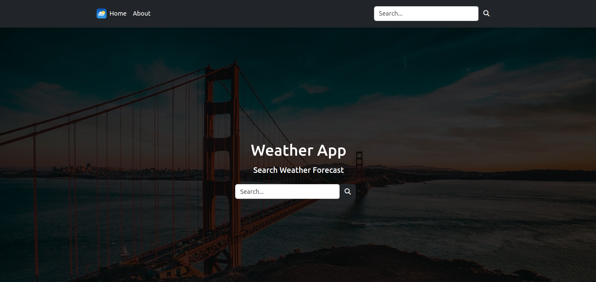
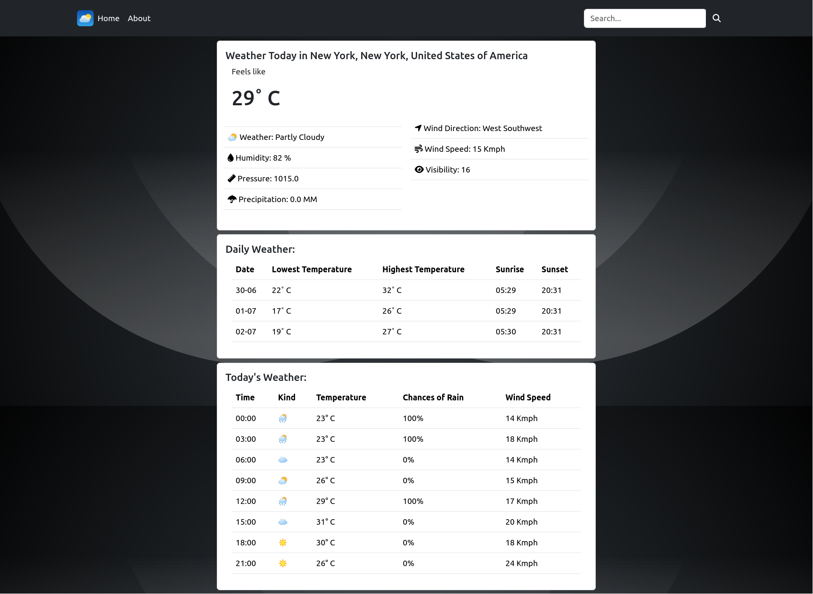

# Weather Web App

Welcome to the Weather Web App! This application allows users to search for a city and view the current weather, as well as the daily and hourly forecasts for that location. The app is built using Django and styled with Bootstrap.

## Table of Contents

- [Features](#features)
- [Installation](#installation)
- [Usage](#usage)
- [Screenshots](#screenshots)
- [Technologies](#technologies)

## Features

- Search for a city to get weather information.
- View current weather conditions.
- Access daily weather forecasts.
- Check hourly weather forecasts.

## Installation

Follow these steps to set up the project on your local machine.

1. **Clone the repository**

   ```bash
   git clone https://github.com/yourusername/weather-webapp.git
   cd weather-webapp
   ```

2. **Set up a virtual environment**

   ```bash
   python -m venv venv
   source venv/bin/activate  # On Windows use `venv\Scripts\activate`
   ```

3. **Install dependencies**

   ```bash
   pip install -r requirements.txt
   ```

4. **Apply migrations**

   ```bash
   python manage.py migrate
   ```

5. **Run the development server**

   ```bash
   python manage.py runserver
   ```

## Usage

1. Open your web browser and go to `http://127.0.0.1:8000`.
2. Enter the name of a city in the search bar.
3. View the current weather, daily, and hourly forecasts for the selected city.

## Screenshots


*Home page where users can search for a city.*


*Weather results page showing current, daily, and hourly weather information.*

## Technologies

- **Django**: Backend framework for Python.
- **Bootstrap**: Frontend framework for responsive design.
- **HTML/CSS**: Markup and styling.
- **JavaScript**: Interactivity on the client side.
- **python-weather**: API for fetching weather data.